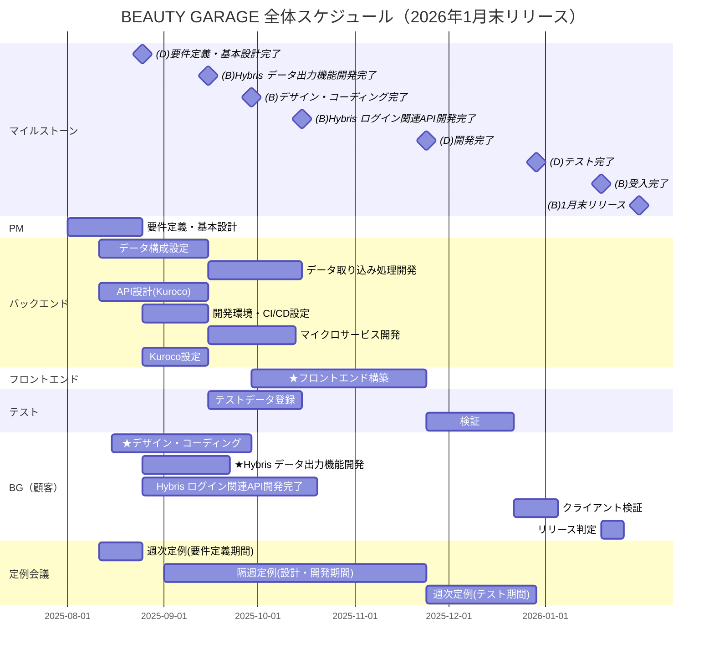

# BEAUTY GARAGE 全体スケジュール

## 関連資料

- [要件定義・基本設計書](要件定義・基本設計書.md)

## 1月末リリース版

## 詳細作業スケジュール（1月末リリース版）

### フェーズ別作業詳細

#### 設計フェーズ (2025/8/1 - 9/29)

| 作業項目           | 期間        | 担当者         | 成果物                 | 備考                                             |
| -------------- | --------- | ----------- | ------------------- | ---------------------------------------------- |
| 要件定義・システム・UX設計 | 8/1-8/25  | PM, デザイナー   | 要件定義書・システム設計書・UX設計書 |                                                |
| ワイヤーフレーム制作     | 8/25-9/3  | PM, デザイナー   | ワイヤーフレーム            |                                                |
| デザイン・コーディング    | 8/15-9/29 | デザイナー, コーダー | デザインデータ・コーディングデータ   | 静的HTML/CSS・レスポンシブ対応・JavaScript（スライダー等のアクション）含む |
| データ構成設定        | 8/11-9/15 | BE, FE      | 項目定義書               |                                                |
| API設計(Kuroco)  | 8/11-9/15 | BE, FE      | API仕様書              |                                                |

#### 開発準備 (2025/8/25 - 10/6)

| 作業項目         | 期間        | 担当者    | 成果物       | 備考  |
| ------------ | --------- | ------ | --------- | --- |
| Kurocoサイト登録  | 8/25-9/1  | 顧客     | Kurocoサイト |     |
| 開発環境・CI/CD設定 | 8/25-9/15 | BE, FE | gitデータ    |     |

#### 開発・実装 (2025/9/15 - 11/24)

| 作業項目        | 期間         | 担当者 | 成果物      | 備考         |
| ----------- | ---------- | --- | -------- | ---------- |
| テストデータ登録    | 9/15-10/15 | BE  | テストデータ   |            |
| データ取り込み処理開発 | 9/15-10/15 | BE  | ソースコード   |            |
| フロントエンド構築   | 9/29-11/24 | FE  | ソースコード   | APIの呼び出し含む |
| マイクロサービス開発  | 9/15-10/13 | BE  | ソースコード   |            |
| Kuroco設定    | 8/25-9/15  | BE  | Kuroco設定 |            |

#### 総合テスト (2025/11/24 - 12/29)

| 作業項目 | 期間        | 担当者   | 成果物       | 備考 |
| -------- | ----------- | -------- | ------------ | ---- |
| 検証     | 11/24-12/22 | テスター | テストケース | 28日間     |
| FB対応   | 12/22-12/26 | BE, FE   | 課題リスト   |      |
| 再検証   | 12/26-12/29 | テスター | テストケース |      |

#### 受入 (2025/12/22 - 2026/1/19)

| 作業項目           | 期間      | 担当者 | 成果物       | 備考 |
| ------------------ | --------- | ------ | ------------ | ---- |
| クライアント検証   | 12/22-1/5  | 顧客   | テストケース | 14日間     |
| FB対応             | 1/5-1/12 | BE, FE | 課題リスト   |      |
| クライアント再検証 | 1/12-1/19 | 顧客   | テストケース |      |

#### リリース (2026/1/19 - 1/31)

| 作業項目     | 期間      | 担当者       | 成果物                 | 備考                  |
| ------------ | --------- | ------------ | ---------------------- | --------------------- |
| リリース判定 | 1/19-1/26 | 顧客         | 議事録                 |                       |
| 本番環境移行 | 1/26-1/31 | サーバ管理者 | リリースチェックリスト | DNS切替・Endpoint切替 |
| 納品         | 1/31      | 顧客, PM     | 納品書                 |                       |

### マイルストーン・定例会議

| マイルストーン     | 日程       | 内容                     |
| ------------------ | ---------- | ------------------------ |
| 要件定義完了       | 2025/8/25  | 要件定義書承認           |
| 設計完了           | 2025/9/29  | システム設計・UX設計完了 |
| Hybris API開発完了 | 2025/10/15 | 外部システム連携準備完了 |
| 開発完了           | 2025/11/24 | 全機能実装完了           |
| テスト完了         | 2025/12/29 | 総合テスト完了           |
| 受入完了           | 2026/1/19  | クライアント受入完了     |
| リリース           | 2026/1/31  | 本番環境リリース         |

**定例ミーティング**

- 要件定義期間（8/11-8/25）: 週1回
- 設計・開発期間: 隔週1回
- テスト期間: 週1回
- 参加者: 顧客 + フェーズ毎該当メンバー

## プロジェクト概要

### 主要マイルストーン

- **2025年8月25日**: 要件定義・基本設計完了
- **2025年9月15日**: Hybris データ出力機能開発完了
- **2025年9月29日**: デザイン・コーディング完了
- **2025年10月15日**: Hybris ログイン関連API開発完了
- **2025年11月24日**: 開発完了
- **2025年12月29日**: テスト完了
- **2026年1月19日**: 受入完了
- **2026年1月31日**: 1月末リリース

### チーム別スケジュール

**BG（Beauty Garage）**

- デザイン・コーディング: 2025/8/15 - 9/29
- Hybris データ出力機能開発: 2025/8/25 - 9/22（28日間）
- Hybris ログイン関連API開発: 2025/8/25 - 10/20（56日間）
- 受入テスト: 2026/1/5 - 1/19
- リリース判定: 2026/1/19 - 1/26

**Diverta フロントエンド**

- フロントエンド構築: 2025/9/29 - 11/24（56日間）
- 総合テスト: 2025/11/24 - 12/29
- リリース準備: 2025/12/29 - 2026/1/19

**Diverta バックエンド**

- データ構成設定: 2025/8/11 - 9/15
- データ取り込み処理開発: 2025/9/15 - 10/15
- API設計(Kuroco): 2025/8/11 - 9/15
- 開発環境・CI/CD設定: 2025/8/25 - 9/15
- マイクロサービス開発: 2025/9/15 - 10/13（28日間）
- Kuroco設定: 2025/8/25 - 9/15
